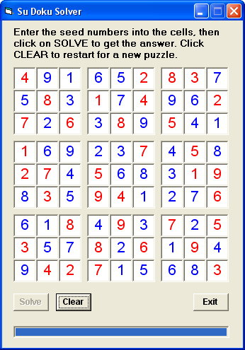

## SuDoku Solver

### Description

Now updated to solve even more difficult puzzles. Uses bitmasks with logical operators when performing the Solve algorithms. Future features will include saving and loading puzzles and puzzle generation.
 
### More Info
 

             |
---                |---
**Submitted On**   |2005-06-20 02:10:02
**By**             |[Nero](https://github.com/Planet-Source-Code/PSCIndex/blob/master/ByAuthor/nero.md)
**Level**          |Advanced
**User Rating**    |4.3 (13 globes from 3 users)
**Compatibility**  |VB 4\.0 \(32\-bit\), VB 5\.0, VB 6\.0
**Category**       |[Games](https://github.com/Planet-Source-Code/PSCIndex/blob/master/ByCategory/games__1-38.md)
**World**          |[Visual Basic](https://github.com/Planet-Source-Code/PSCIndex/blob/master/ByWorld/visual-basic.md)
**Archive File**   |[SuDoku\_Sol1903696202005\.zip](https://github.com/Planet-Source-Code/nero-sudoku-solver__1-61132/archive/master.zip)

